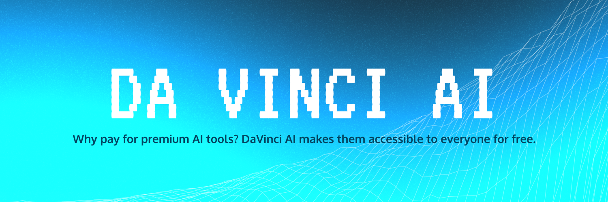

# DaVinci AI


## Features

- Based on Next.js 14 (App Router, Server Actions), shadcn/ui, TailwindCSS, Vercel AI SDK.
- Streaming in the UI.
- Can install and use any package from npm, pip.
- Supported stacks:
  - 🔸 Python interpreter
  - 🔸 Next.js
  - 🔸 Vue.js
  - 🔸 Streamlit
  - 🔸 Gradio
- Supported LLM Providers:
  - 🔸 OpenAI
  - 🔸 Anthropic
  - 🔸 Google AI
  - 🔸 Mistral
  - 🔸 Groq
  - 🔸 Fireworks
  - 🔸 Together AI
  - 🔸 Ollama

## Get started

### 1. Clone the repository

In your terminal:

```
git clone https://github.com/Mechatomic-AI/DaVinciAI
```

### 2. Install the dependencies

Enter the repository:

```
cd DaVinciAI
```

Run the following to install the required dependencies:

```
npm i
```

### 3. Set the environment variables

Create a `.env` file and set the following:

```sh
E2B_API_KEY=
OPENAI_API_KEY=

# Other providers
ANTHROPIC_API_KEY=
GROQ_API_KEY=
FIREWORKS_API_KEY=
TOGETHER_API_KEY=
GOOGLE_AI_API_KEY=
GOOGLE_VERTEX_CREDENTIALS=
MISTRAL_API_KEY=
XAI_API_KEY=

### 4. Start the development server

```
npm run dev
```

### 5. Build the web app

```
npm run build
```

## Contributing

As an open-source project, we welcome contributions from the community. If you are experiencing any bugs or want to add some improvements, please feel free to open an issue or pull request.
